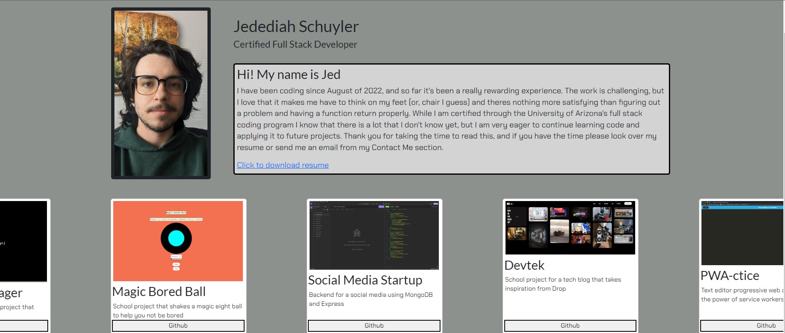

 # portfolio

### Description

This is my portfolio, it includes my projects, current resume, and a way to contact me.

[Check it out!](https://jschuyl.github.io/portfolio/)

## Table of Contents
1. [Description: ](#description)
2. [Installation Guide: ](#installation-Guide)
3. [Contribution Guide: ](#contribution-Guide)
- [License](#license)
- [Contacts ](#contact-me)

[Back to top](#title)
## Installation Guide

you don't, just go to the deployed link :)

[Back to top](#title)
## Contribution Guide

Hire me please

[Back to top](#title)

## License
  This project is under the MIT License
[Details on the MIT License](https://choosealicense.com/licenses/mit/)

## Contact Me
### Email
[schuylertjed@gmail.com](mailto:schuylertjed@gmail.com)
### Github
[jschuyl](https://github.com/jschuyl)

[Back to top](#title)
